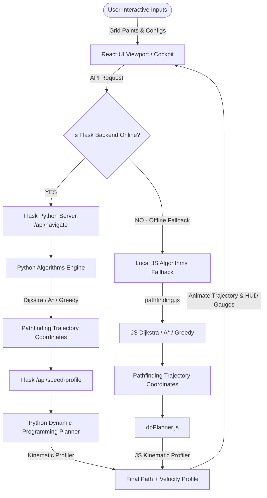

# 🏎️ Autonomous Vehicle Navigation & Safety Profile Visualizer

[](https://opensource.org/licenses/MIT)
[](https://react.dev/)
[](https://flask.palletsprojects.com/)
[](#)
[](#)

An immersive, interactive academic mini-project demonstrating how self-driving systems compute collision-free trajectories and optimize velocity profiles in real time. This platform models standard robotics pathfinding and kinematic acceleration boundaries through a responsive, cyberpunk-inspired digital HUD cockpit.

---

## 🌟 Visual Preview & High-Fidelity HUD Cockpit

The interface simulates an **Autonomous Vehicle Cockpit (20x30 Grid Arena)** with dynamic widgets, analytical telemetry metrics, and step-by-step algorithms execution logs:

```
+-----------------------------------------------------------------------------+
|  [⚡ AUTO-NAV CORE]  [PATHFINDING ARENA]  [THEORY CORE]  [COMPARISON BOARD] |
+-----------------------------------------------------------------------------+
|                                  |  [SYSTEM STATUS & SCORECARD]             |
|   CAR (Start)                    |  - Algorithm: A* Search                  |
|     |                            |  - Exploration Latency: 0.82 ms          |
|     v [Road Hazards / Mud]       |  - Explored Nodes: 134 cells             |
|    [###] Obstacle Blocked        |  - Generated Path Length: 42 meters      |
|     |                            |  - Telemetry: Speed 36.4 km/h | 1.8 m/s² |
|     v [Re-routing Path]          |                                          |
|   DESTINATION (Target)           |  [BLACK BOX DATA RECORDER]               |
|                                  |  -> Download telemetry logs (.csv)       |
+-----------------------------------------------------------------------------+
```

---

## 🚀 Key Architectural Features

1. **Interactive Pathfinding Arena (20x30 Navigation Grid)**
   - Paint and drag interactive grid nodes: Set **Self-Driving Car** (Start Position), **Destination** (Target Location), **Road Obstacles** (Impassable Barriers), and **Hazard Zones** (Friction-laden mud causing vehicle slowdown).
   - Configure steering bounds: Choose between **4-way orthogonal grid search** or **8-way diagonal steering path calculations** with realistic diagonal cost penalties ($1.414\times$).

2. **Multi-Algorithm Comparison Suite**
   - **A* Search (Optimal & Heuristic-Driven):** Utilizes Manhattan and Octile heuristics to minimize explored states, finding the exact shortest path with high efficiency.
   - **Dijkstra's Algorithm (Guaranteed Shortest Path):** Exhaustive uniform exploration for single-source shortest path planning. Ideal for modeling static maps.
   - **Greedy Best-First Search (Sub-optimal Heuristic Scan):** Extremely fast execution but susceptible to being trapped in local concave obstacle traps.

3. **Dynamic Programming (DP) Velocity Profile Optimizer**
   - Implements a continuous speed-profiling planner based on a **Bellman recurrence formulation**.
   - Enforces physical motor acceleration constraints ($V_{next} = \sqrt{V_{curr}^2 + 2 a_{acc} dx}$) and safe emergency braking constraints ($V_{curr} = \sqrt{V_{next}^2 + 2 a_{dec} dx}$).
   - Adjusts vehicle speed dynamic targets: Enforces automatic speed drops at sharp curvature corners and slow speed parameters when traversing hazard zones.

4. **Dynamic Mid-Drive Obstacle Avoidance & Recalculation**
   - Place obstacles dynamically on the active trajectory while the car is in motion.
   - The car triggers an **Emergency Brake (decelerating live on HUD)**, halts, runs an active re-routing computation from its current grid cell, and safely bypasses the new roadblock!

5. **Integrated Diagnostic Scorecard & CSV Exporter**
   - Tracks search latency (ms), node exploration count, path length, and active velocity.
   - Compare all algorithms side-by-side on an interactive **Comparison Scorecard**.
   - **Export Black-Box Telemetry**: Instantly download vehicle logs as `.csv` data files, capturing row/col coordinates, speed (km/h), and acceleration ($m/s^2$) at each point.

---

## 🏗️ Robust System Architecture

This project is built using a **decoupled Dual-Engine Fallback architecture**. If the Flask Python backend is offline, the React frontend seamlessly routes computation internally to client-side Javascript pathfinders and speed planners. This ensures the demo is highly robust and operates perfectly in offline classrooms or remote hosting services (like Vercel).



---

## 📊 Analytical Complexity Matrix

| Algorithm | Optimality | Time Complexity | Space Complexity | Best Suited For |
| :--- | :---: | :---: | :---: | :--- |
| **A\* Search** | Guaranteed Optimal | $O(\|E\| \log \|V\|)$ | $O(\|V\|)$ | Real-time tactical autonomous routing |
| **Dijkstra** | Guaranteed Optimal | $O(\|V\| \log \|V\| + \|E\|)$ | $O(\|V\|)$ | Global macro-scale map planning |
| **Greedy BFS** | Sub-optimal | $O(b^d)$ (Worst Case) | $O(b^d)$ | Fast search in open terrain |
| **DP Velocity Optimizer** | Optimal Profile | $O(N)$ (where $N = \text{Path Length}$) | $O(N)$ | Smooth kinematic path profile generation |

---

## 🔬 Mathematical Formulations

### 1. Octile Heuristic (8-way Steering Heuristic)
For two-dimensional coordinate points $(r_1, c_1)$ and $(r_2, c_2)$, the Octile heuristic accounts for diagonal steering movements ($1.414\times$ orthogonal cost):
$$h(n) = \min(|r_1 - r_2|, |c_1 - c_2|) \times \sqrt{2} + \big||r_1 - r_2| - |c_1 - c_2|\big|$$

### 2. Kinematic Velocity Profile Recurrence
The velocity $v_i$ at grid node $i$ is constrained by speed limits $L_i$ (sharp turns, hazards) and acceleration boundaries over grid intervals $dx$:

* **Deceleration Boundary (Backward Pass)**: Enforces that the vehicle can safely decelerate to a complete stop at the final destination node:
  $$v_i = \min\left(L_i, \sqrt{v_{i+1}^2 + 2 \cdot a_{\text{decel}} \cdot dx}\right)$$
* **Acceleration Boundary (Forward Pass)**: Constraints vehicle speed based on the previous node's speed and maximum engine acceleration capabilities:
  $$v_i = \min\left(v_i, \sqrt{v_{i-1}^2 + 2 \cdot a_{\text{accel}} \cdot dx}\right)$$

---

## 🛠️ Workspace & Codebase Structure

```
AUTO-NAV/
├── backend/
│   ├── app.py                # Main Flask entry point (CORS, REST API router)
│   ├── algorithms.py         # Python Dijkstra, A*, Greedy BFS, and DP speed profilers
│   └── requirements.txt      # Python dependencies (Flask, Flask-Cors)
├── frontend/
│   ├── package.json          # Node module configurations (Vite, React)
│   ├── index.html            # Main Single-Page App wrapper with optimized SEO tags
│   └── src/
│       ├── main.jsx          # React app mounter
│       ├── App.jsx           # Global state router, layout, and HUD state orchestrator
│       ├── index.css         # Immersive cyberpunk digital HUD style sheet
│       ├── components/
│       │   ├── Header.jsx              # Cockpit Navigation layout
│       │   ├── GridVisualizer.jsx      # Navigation grid arena, paint tools, mouse handlers
│       │   ├── DashboardStats.jsx      # Telemetry speedometers, status feeds, active gauges
│       │   ├── AboutSection.jsx        # Autonomous robotics layers introduction
│       │   ├── TheorySection.jsx       # Mathematical equations and LaTeX academic proofs
│       │   ├── ComparisonDashboard.jsx # Complexity grid metrics and scoreboard
│       │   └── Documentation.jsx       # In-app setup instructions and manual
│       └── utils/
│           ├── pathfinding.js          # JavaScript pathfinding algorithms (offline engine)
│           └── dpPlanner.js            # JavaScript dynamic programming velocity optimizer (offline engine)
└── README.md                 # Project root workspace documentation (this file)
```

---

## 🚀 Installation & Local Execution Manual

### 1. Spin up the Flask Python Backend
Open a terminal and navigate to the `/backend` directory:
```bash
cd backend
```

Create a Python virtual environment:
```bash
# Windows
python -m venv venv
venv\Scripts\activate

# macOS / Linux
python3 -m venv venv
source venv/bin/activate
```

Install the requirements package:
```bash
pip install -r requirements.txt
```

Launch the Flask development server:
```bash
python app.py
```
*The server will start running on **`http://127.0.0.1:5000/`**. Verify status by navigating to `http://127.0.0.1:5000/api/health`.*

---

### 2. Spin up the React Frontend
Open a new terminal window and navigate to the `/frontend` directory:
```bash
cd frontend
```

Install the Node dependencies:
```bash
npm install
```

Launch the Vite React development server:
```bash
npm run dev
```
*The system will launch the local dashboard on **`http://localhost:5173/`**. Click the URL link to open the vehicle control cockpit!*

---

## 🛡️ License

This project is licensed under the MIT License - see the [LICENSE](LICENSE) file for details. Created as an Algorithms Subject Mini-Project. Feel free to fork, expand, and utilize the dual-engine fallback in your own robotics simulations!
